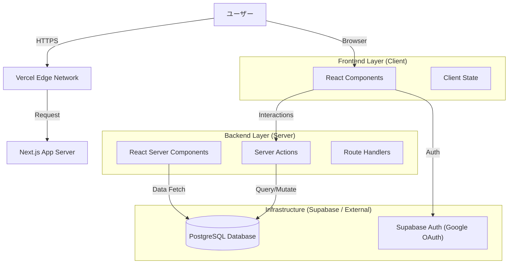
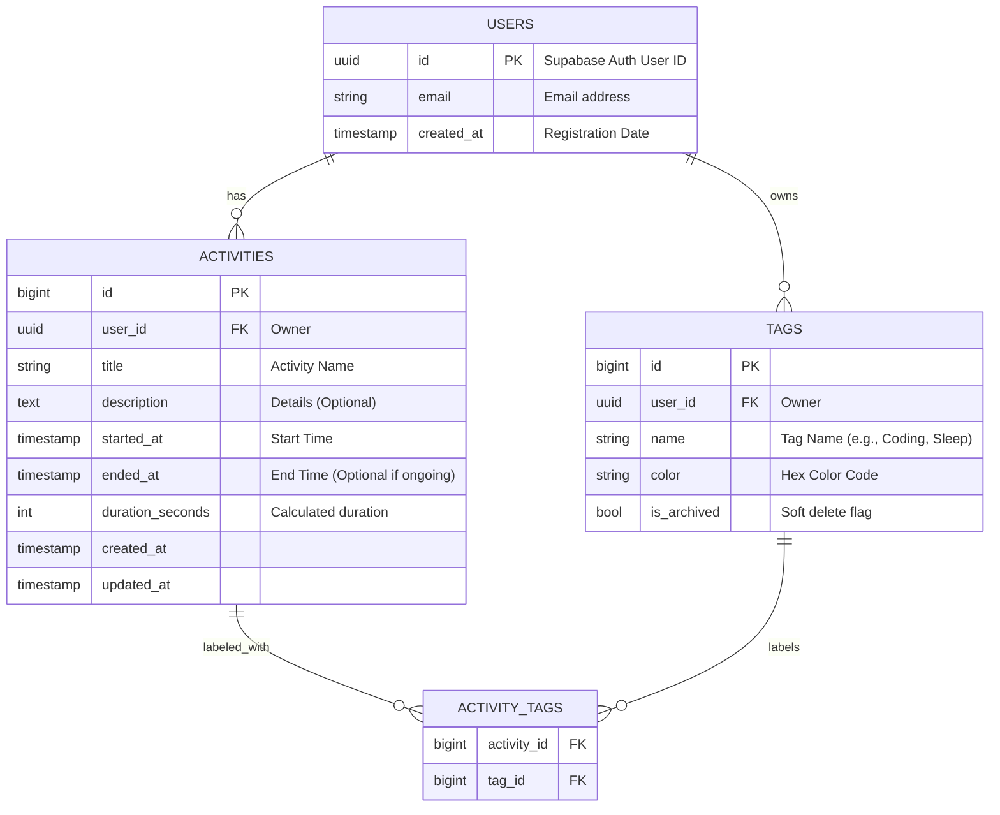
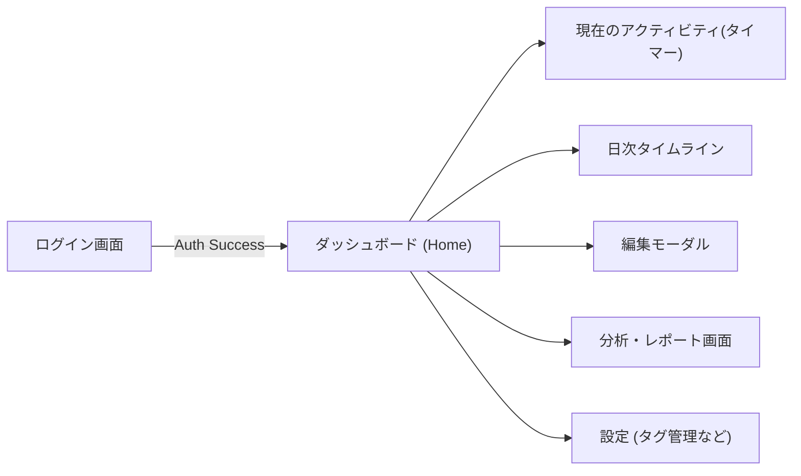

# システム設計書 (System Design Document)

## 1. アーキテクチャ概要

本システムは、Next.js (App Router) を中心としたモダンなWebアプリケーションとして構築する。
フロントエンドとバックエンドロジックをNext.jsに集約し、データベースおよび認証基盤としてSupabaseを採用する。

### 1.1 全体構成図

### 1.2 技術スタック選定理由

- **Framework**: **Next.js 15+ (App Router)**
  - 最新のReact機能 (RSC, Server Actions) をフル活用し、API層を別途構築する手間を削減。
  - Vercelへのデプロイ親和性が高く、パフォーマンス最適化が容易。
- **Language**: **TypeScript**
  - 型安全性による保守性の向上。
- **Styling**: **Tailwind CSS**
  - 迅速なUI構築と、デザインシステムの一貫性維持のため。
- **Database / Auth**: **Supabase**
  - Postgresのフルマネージドサービス。
  - 認証 (Google OAuth) が統合されており、実装コストが低い。
  - Row Level Security (RLS) による堅牢なセキュリティ。

---

## 2. データベース設計

### 2.1 ER図 (Entity Relationship Diagram)

### 2.2 テーブル定義詳細

#### `activities`
活動記録の本体。
- `user_id`: RLS用。自分のデータのみ参照可能にする。
- `started_at`, `ended_at`: タイムゾーン考慮が必要 (UTCで保存、表示時にJST変換)。
- `duration_seconds`: `ended_at - started_at` で計算可能だが、集計高速化のために持たせるか検討（今回は計算列またはViewで対応し、物理カラムは一旦不要とするが、パフォーマンス要件次第で追加）。

#### `tags`
活動の分類。
- ユーザーごとにカスタマイズ可能。
- `color`: タイムライン表示時の識別用。

### 2.3 セキュリティ設計 (RLS Policies)

全テーブルにおいて `user_id` カラムを持ち、以下のポリシーを適用する。

- **SELECT**: `auth.uid() = user_id`
- **INSERT**: `auth.uid() = user_id`
- **UPDATE**: `auth.uid() = user_id`
- **DELETE**: `auth.uid() = user_id`

これにより、APIレベルでのフィルタリング漏れがあっても他人のデータへアクセスされることを防ぐ。

---

## 3. インターフェース設計

### 3.1 画面遷移図

### 3.2 詳細UIコンポーネント案

- **Timeline View**:
  - 24時間を縦軸にとったバーチカルタイムライン。
  - 空き時間は「不明な時間」としてグレーアウト、またはワンクリックで埋める機能を搭載。
- **Current Activity Widget**:
  - ヘッダーまたはフローティングアクションボタン(FAB)として常駐。
  - 現在進行中のタスク名と経過時間をリアルタイム表示。
  - 「停止」「切り替え」をワンアクションで行えるようにする。

---

## 4. API設計 (Server Actions)

Next.js App Routerを採用するため、REST APIエンドポイントは最小限にし、Server Actionsを主軸とする。

### 4.1 主なServer Actions

- **Projects/Activities**
  - `startActivity(title: string, tagIds: number[])`: 現在のアクティビティを開始（前のタスクがあれば終了）。
  - `stopActivity(id: number)`: 指定アクティビティを終了。
  - `updateActivity(id: number, data: Partial<Activity>)`: 編集。
  - `deleteActivity(id: number)`: 削除。
  - `getDailyActivities(date: Date)`: 指定日の記録を取得。

- **Tags**
  - `createTag(name: string, color: string)`
  - `getTags()`

---

## 5. 運用・保守

- **バックアップ**: Supabaseの自動バックアップ機能を利用。
- **ログ**: Vercel Analytics / Supabase Logs。
